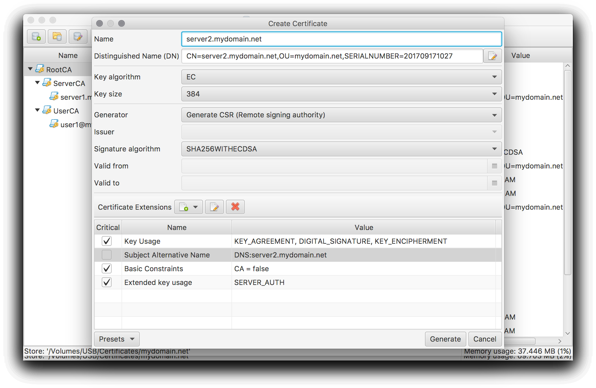
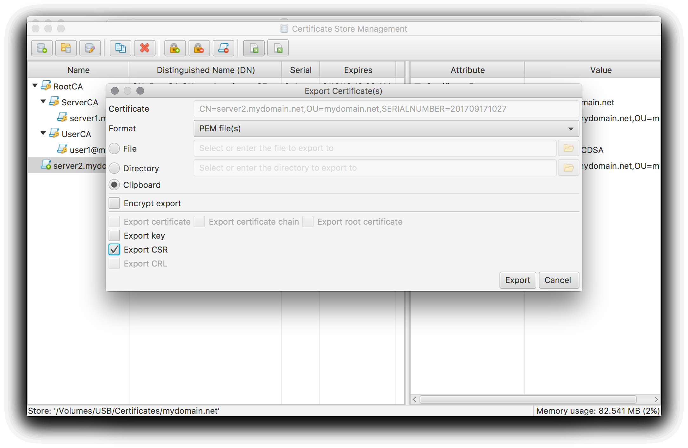

### How to create and manage certificates of an external CA
This HowTo applies to a setup where the actual certificate issuer is an external CA operated by a 3rd party. A [google search](https://www.google.de/search?q=how+to+get+ssl+certificate) will bring up the usual suspects.

The CertMgr application supports external CAs in a generic way by generating Certificate Signing Requests (CSR). The simplified CSR workflow is as follows:
 * CertMgr creates a private key as well as a CSR object. The CSR receives the requested Certificate options and is signed by the private key.
 * Only the CSR object is submitted to the external CA's provider (in a provider specific way, e.g. via a web form).
 * The provider performs the necessary checks and responds with a signed certificate. The latter can be imported into the certificate store.

Please check the [Create your own private CA](../howtoLocalCA/) for how a certificate store as well a certificate is created.

#### Generate CSR
To generate a CSR press the **Generate/Request new certificate** tool button or select the corresponding menu entry.

Make sure the Generator option is set to **Generate CSR (Remote signing authority)** to generate a CSR.
Enter a suitable name for the requested certificate and setup suitable defaults by entering them manually or apply one of the available presets.

What certificate options are supported or allowed depends on your provider. E.g. most free services will only use the public key from the CSR, derive the CN from the requested services (server or client certificate) and ignore everything else.

By pressing the **Generate** button and entering a password for the private key the CSR will be created.

#### Use export and import to exchange CSR and Certificate
Invoke the export dialog by pressing the **Export Certificate(s)** tool button or selecting the corresponding menu entry.

Make sure only the CSR object is selected for export. The format and transfer type has to be setup according to your provider (e.g. Clipboard for copying the CSR into a web form).

Use the CertMgr's import functions to import the certificate provided by the provider in return. See [Import existing certificate objects](../howtoImport/) for how to import it.

Most likely the imported certificate will be shown with an _external_ issuer. This is caused by the fact that the provider certificates are not available in the certificate store. Use your provider's documentation to check how to obtain the necessary certificates (e.g. via download from the provider's home page) and import them as shown in [Import existing certificate objects](../howtoImport/).

[<< Index](..)
