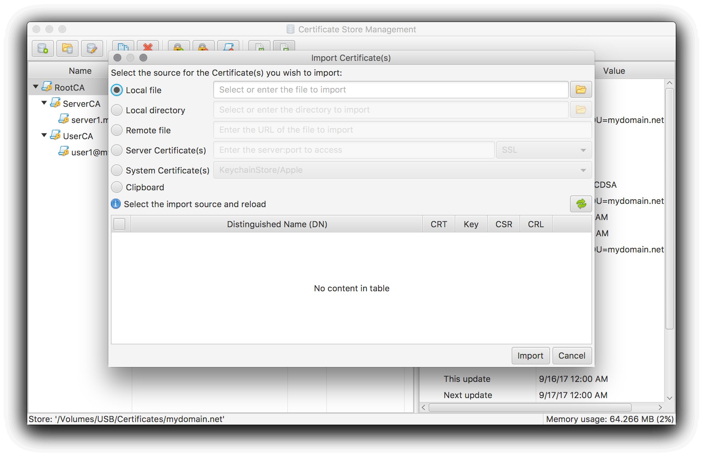
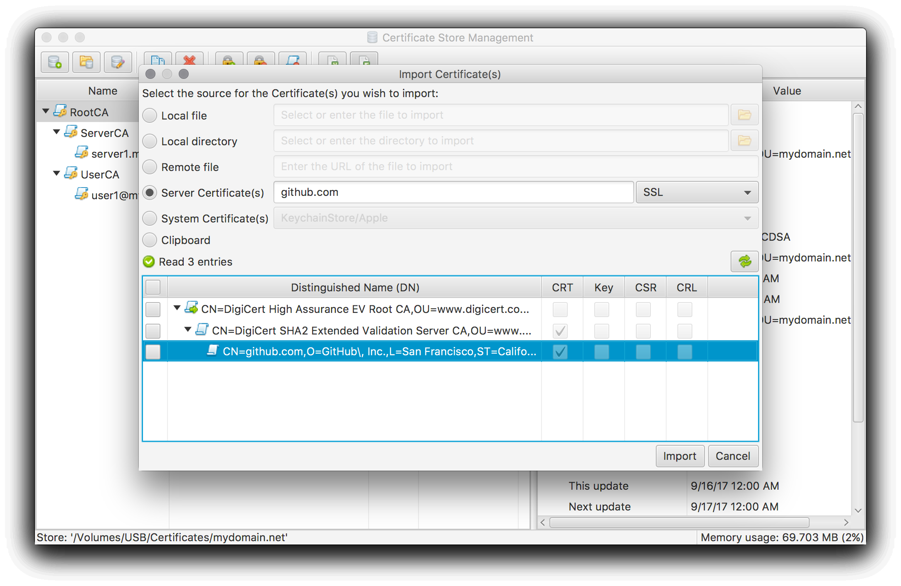

### How to import existing certificate objects
The CertMgr application can import certificate objects from the following formats:

 * DER - Binary encoded certificate objects
 * PEM - ASCII encoded certificate objects
 * PKCS#12 - Binary exchange format for certificate objects
 * JKS - Java Key Store format

The actual format is detected automatically.
The data can be imported from various sources:

 * Local file - Read data from a single file
 * Local directory - Read data from multiple files
 * Remote file - Read data from an URL
 * Server Certificate(s) - Read data from server connection
 * System Certificate(s) - Read data from system certificate store (not available on all platforms)
 * Clipboard - Read data from Clipboard

#### Read available certificate objects
After entering or selecting the actual source input and parameters the import dialog automatically or by pressing the refresh button will read all available certificate objects.

If an encrypted object is encountered you will be asked to enter the required password. By pressing cancel or cancel all the current or all encrypted objects can be ignored.

After the read operation has been finished the found certificate objects will be displayed in the dialog:

#### Select and import
Now you can select the certificate objects you want to import and by pressing the Import button they will be imported into the current certificate store.

In case a private key is imported the import dialog will automatically ask for a password to encrypt the private key in the certificate store. Cancelling this password dialog will cancel the import.

[<< Index](..)
