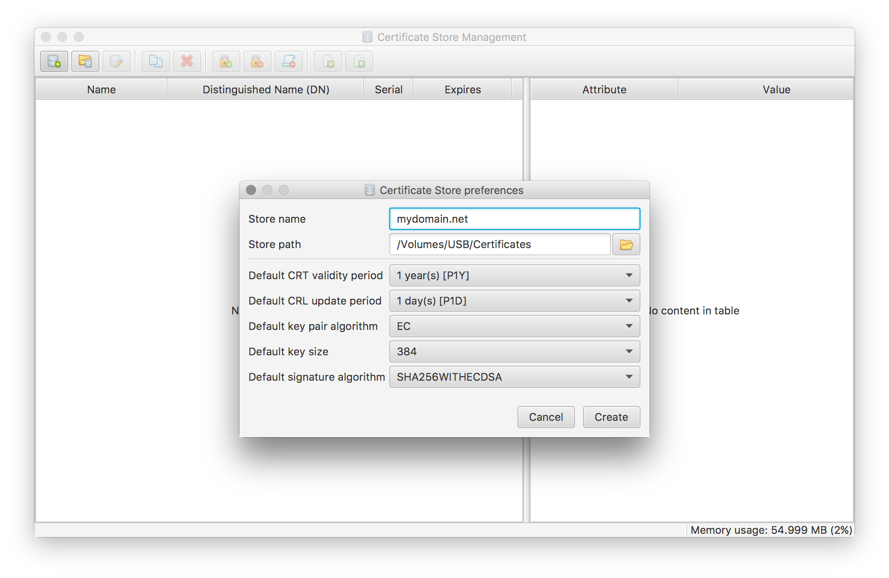
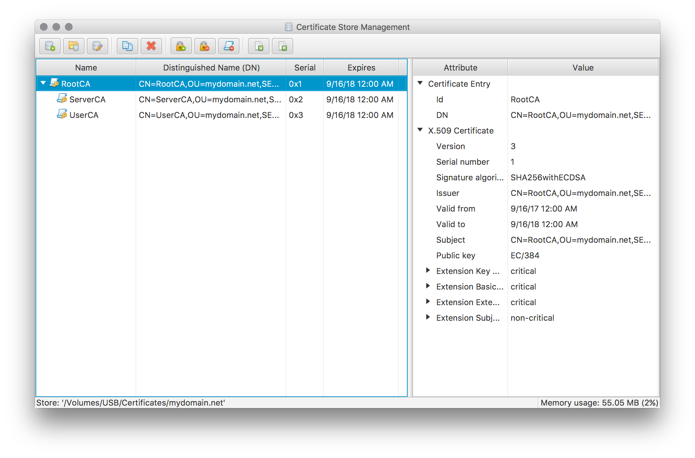
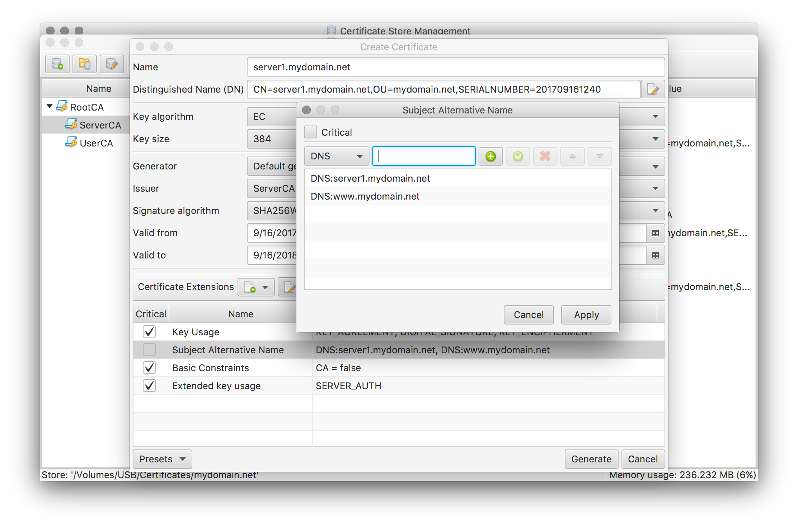

### How to create your own private CA
Creating you own private CA is suitable approach for securing your own private network where you have control of every device connected to the network.

The latter is required because of the fact that your CA's root certificate has to be installed on the devices in order to accept your CA as valid.

A typical usage scenario for a private CA is private HTTP server where the CA's certificates are used for https encryption as well as for user authentication. Only users with a trusted client certificate are allowed to access the network.

The following steps create a simple demo CA to show the needed CertMgr functions. To create a real CA you need to adapt the procedure (especially the server and user certificate generation) to fit your requirements.

#### Setup Certificate Store
Press the **New store** tool button or select the corresponding menu entry to bring up the **Certificate store preferences** dialog:

Enter your domain name for the new store's name, as the store name will be used to derive the default names of your certificates. Select all other options according to your own needs and preferences.
Except for store name and path all of these options can be modified afterwards using the same dialog.

#### Create Root Certificate
Create the self-signed root certificate for your CA by pressing the **Generate/Request new certificate** tool button or selecting the corresponding menu entry.

Enter a suitable name for the root certificate and setup suitable defaults by applying the **RootCA preset template** (as shown in the screen above). Adapt the chosen defaults according to your own needs. Make sure to leave the Generator and Issuer options unchanged to create a self-signed root certificate. By pressing the **Generate** button and entering a password for the root certificate's private key this step will be finished.

To make your CA trusted on every device in your network the just created root certificate has to be exported (without private key) and installed as a trusted root certificate on every device.

#### Generate Intermediate Certificates
Next step is to create the necessary intermediate certificates for issuing the actual server and user certificates later on. For a real simple setup this step may be omitted and the root certificate be used directly to issue additional certificates. However this also reduces the level of flexibility and control for the new CA. E.g. if we want to grant access to only user certificates.

Create intermediate certificates for a Server CA and a User CA by using the same steps as for the root certificate before, but use the **IntermediateCA preset template** and make sure the root certificate is selected as the issuer. Please note that this template defines a default CRL Distribution Points extension. If you want to make use of CRLs please make sure the defined URL is suitable for your setup. Otherwise simply remove this extension.

The certificate store now contains the necessary CA certificates to issue the actual server and user certificates.

#### Generate Server certificate
Create a server certificate by performing merely the same steps as above but use the Server CA certificate as the issuer and use the **Server preset template** for suitable certificate defaults. This preset creates an initial Subject Alternative Name extension. This extension has to be updated to contain the CN name as well as all other possible names. As for the intermediate certificates the created CRL Distribution Points extension has to be updated or removed.

#### Generate User certificate
To create an user certificate use the User CA certificate as the issuer and the **User preset template**. Again adapt the pre-created Subject Alternative Name extension accordingly as well as the CRL Distribution Points extension.

#### Generate initial CRLs
If you have chosen to maintain a CRL you need to create them initially. Press the **Manage Certificate Revocation List (CRL)** tool button or select the corresponding menu entry. In the upcoming dialog simply press the update button and sign the CRL by entering the CA's password.

#### Exporting the created certificate objects
Use the **Export certificates** tool button or select the corresponding menu entry to invoke the export dialog for the currently selected certificate object.

Which certificate objects have to be exported and how depends on the actual usage scenario. The usual ones are:

 * Export user certificate into a PKCS#12 file including private key for import into the OS' user certificate store. Afterwards the certificate will be available for user authentication in web browser, VPN clients, etc. .
 * Export server certificate, key as well as the accompanying certificate chain into separate PEM encoded files for Apache setup (see [Configure Apache to use your certificates](../howtoApache/)).

[<< Index](..)
