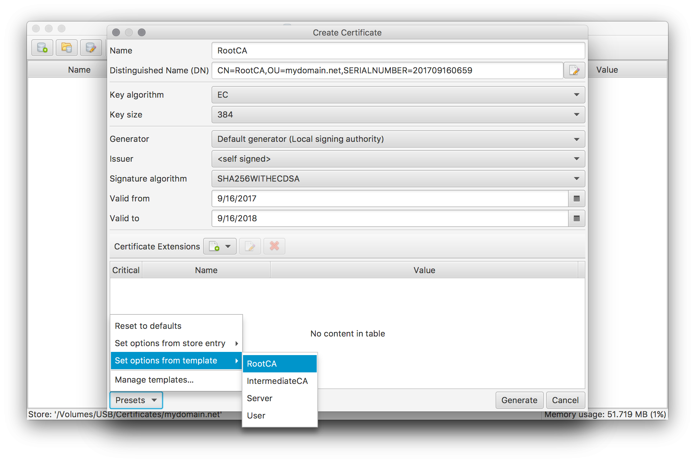

### How to create your own private CA

Creating you own private CA is suitable approach for securing your own private network where you have control about every device connected to the network.

The latter is required because of the fact that your CA's root certificate has to be installed on the devices in order to accept your CA as valid.

A typical usage scenario for a private CA is private HTTP server where the CA's certificates are used for https encryption as well as for user authentication. Only users with a trusted client certificate are allowed to access the network.

#### Setup Certificate Store
Press the **New store** tool button or select the corresponding menu entry to bring up the **Certificate store preferences** dialog:

Enter your domain name for the new store's name, as the store name will be used to derive the default names of your certificates. Select all other options according to your own needs and preferences.
Except for store name and path all of these options can be modified afterwards using the same dialog.

#### Create Root Certificate
Create the self-signed root certificate for your CA by pressing the **Generate/Request new certificate** tool button or selecting the corresponding menu entry.

Enter a suitable name for the root certificate and setup suitable defaults by applying the **RootCA preset template** (as shown in the screen above). Adapt the chosen defaults according to your own needs. Make sure to leave the Generator and Issuer options unchanged to create a self-signed root certificate. By pressing the **Generate** button and entering a password for the root certificate's private key this step will be finished.

#### Generate Intermediate Certificates
Next step is to create the necessary intermediate certificates for issuing the actual server and user certificates later on. For a real simple setup this step may be omitted and the root certificate be used directly to issue additional certificates. However this also reduces the level of flexibility and control for the new CA. E.g. if we want to grant access to only user certificates.

Create the intermediate certificates for a Server CA and a User CA by using the same steps as for the root certificate before, but use the **IntermediateCA preset template**. Please note that this template defines a default CRL Distribution Points extension. If you want to make use of CRLs please make sure the defined URL is suitable for your setup. Otherwise simply remove this extension.

The certificate store now contains the necessary CA certificates to issue the actual server and user certificates.

#### Generate Server certificates

[<< Back](..)
