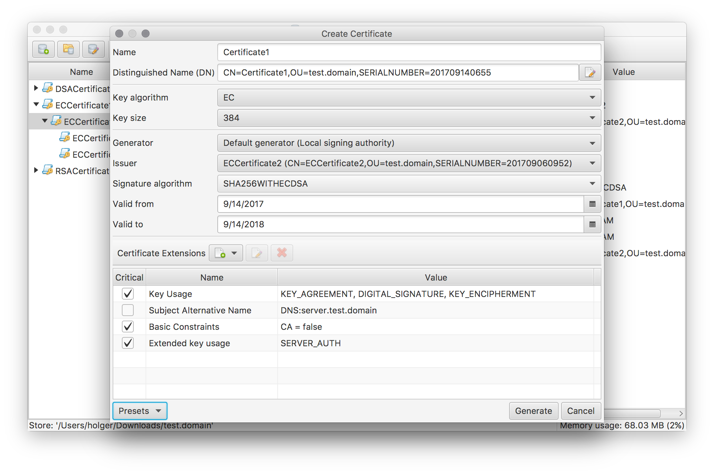

## CertMgr
Create and manage X.509 certificates.



### About CertMgr
The Certificate Manager application (CertMgr) supports the creation and management of X.509 certificates and their corresponding objects.

Certificates are organized in so called Certificate store. Such a store is actually a simple directory structure containing the individual certificate files.

The application supports the following certificate operations:
 * Creation and management of **private certificates** (signed by your own Certificate Authority)
 * Creation and management of **public certificates** (signed by an external Certificate Authority)
 * Creation and management of **Certificate Revocation Lists** (CRL)
 * **Import and export** of certificates (in PEM, DER, PKCS#12 as well as JKS format)

### Installation & usage:
A Java SE 8 Runtime Environment (JRE) is required to run CertMgr.

Download the latest version from the project's [releases page](https://github.com/hdecarne/certmgr/releases/latest).

Simply extract the downloaded archive to a folder of your choice.
The archive contains a single executable Jar as well as a folder with the license information. Invoke the application by either double clicking the jar or invoke the command

```
java -jar de.carne.certmgr.jar [command line arguments]
```

in a terminal. The application command line supports the following options:

```
de.carne.certmgr.jar [--verbose|--debug] [store home]

--verbose
	Enable verbose logging.
--debug
	Enable debug logging.

store home
	The store home path to open.
```

### Changelog:
* 2017-09-14 (v1.0.0-beta1)
 * Initial release of new completely re-build version.
* 2016-05-29 (latest release of 0.2.x branch)
 * Various bug fixes and code cleanups.
